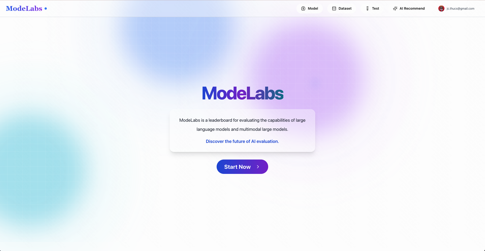

# ModelLabs 模型实验室

[English](#english) | [中文](#chinese)



<a name="english"></a>
## English

### Overview
ModelLabs is a comprehensive platform for model evaluation and comparison. It provides an intuitive interface for testing, ranking, and analyzing different AI models, making it easier for researchers and developers to assess model performance.

### Features
- **Model Testing**: Easy-to-use interface for testing different models
- **Performance Ranking**: Compare and rank models based on various metrics
- **Evaluation Results**: Detailed evaluation results and performance analysis
- **Interactive Dashboard**: User-friendly visualization of test results

### Tech Stack
- Frontend: React.js
- Backend: Node.js/TypeScript
- Database: PostgreSQL
- Containerization: Docker

### Getting Started
1. Clone the repository
```bash
git clone [repository-url]
```

2. Install dependencies
```bash
# Install root dependencies
npm install

# Install client dependencies
cd client
npm install

# Install server dependencies
cd ../server
npm install
```

3. Set up environment variables
```bash
cp .env.example .env
```

4. Start the application
```bash
docker-compose up
```

The application will be available at `http://localhost:3000`

---

<a name="chinese"></a>
## 中文

### 概述
ModelLabs（模型实验室）是一个综合性的模型评估和比较平台。它为研究人员和开发者提供了直观的界面，用于测试、排名和分析不同的AI模型，使模型性能评估变得更加简单。

### 功能特点
- **模型测试**：简单易用的模型测试界面
- **性能排名**：基于多种指标对模型进行比较和排名
- **评估结果**：详细的评估结果和性能分析
- **交互式仪表板**：用户友好的测试结果可视化

### 技术栈
- 前端：React.js
- 后端：Node.js/TypeScript
- 数据库：PostgreSQL
- 容器化：Docker

### 快速开始
1. 克隆仓库
```bash
git clone [仓库地址]
```

2. 安装依赖
```bash
# 安装根目录依赖
npm install

# 安装客户端依赖
cd client
npm install

# 安装服务端依赖
cd ../server
npm install
```

3. 设置环境变量
```bash
cp .env.example .env
```

4. 启动应用
```bash
docker-compose up
```

应用将在 `http://localhost:3000` 上运行
